```{r setup, include=FALSE}
knitr::opts_chunk$set(echo = FALSE)
```

# Задача №1

Дана функция: $f(X) = 15 + 0.02 \cdot X - 0.005 \cdot (X - 45) ^ 2 + 0.00006 \cdot (X - 54) ^ 3$.

Необходимо построить три графика:

*   график истинной взаимосвязи;
*   график зависимости MSE от гибкости модели;
*   график лучшей модели (компромисс между гибкостью и точностью.

При этом необходимо выбрать число степеней свободы как компромисс между точностью (оценкой ошибки на тестовой выборке) и простотой модели (числом степеней свободы).

Распределение X и Y: 

*   $X ~ U(5, 105)$;
*   $Y = f(X) + \epsilon$, где $f(X) = 15 + 0.02 \cdot X - 0.005 \cdot (X - 45) ^ 2 + 0.00006 \cdot (X - 54) ^ 3$.

```{r data_generation}
# data generation
my.seed <- 8  # kernel
n.all <- 60 # all observations
train.percent <- 0.85 # percentage of education selection
res.sd <- 1 # standard deviation of random noise
x.min <- 5  # min boundary of X
x.max <- 105  # max boundary of X

set.seed(my.seed)
x <- runif(x.min, x.max, n = n.all)  # actual X value

set.seed(my.seed)
res <- rnorm(mean = 0, sd = res.sd, n = n.all)  # random noise

set.seed(my.seed)
inTrain <- sample(seq_along(x), size = train.percent * n.all) # take values for education selection

y.func <- function(x) {15 + 0.02 * x - 0.005 * (x - 45) ^ 2 + 0.00006 * (x - 54) ^ 3} # true interconnection function

# lines for true relationship plot
x.line <- seq(x.min, x.max, length = n.all)
y.line <- y.func(x.line)

y <- y.func(x) + res # actual y value with noises

# create vectors with data for plots

# observations based on an education selection
x.train <- x[inTrain]
y.train <- y[inTrain]

# observations based on a testing selection
x.test <- x[-inTrain]
y.test <- y[-inTrain]
```

Изобразим исходные данные на графике:

```{r true_relationship_plot}
# save plot to file with png format
png(filename = 'true_relationship_plot_1.png', width = 600, height = 450, 
    units = 'px', pointsize = 12, res = NA)

par(mar = c(4, 4, 1, 1)) # remove wide fields

# min and max observations on axis
x.lim <- c(x.min, x.max)
y.lim <- c(min(y), max(y))

# plot of observations with noises
x = plot(x.train, y.train,
     col = grey(0.2), bg = grey(0.2), pch = 21,
     xlab = 'X', ylab = 'Y',
     xlim = x.lim, ylim = y.lim,
     cex = 1.2, cex.lab = 1.2, cex.axis = 1.2)

mtext('Исходные данные и истинная фунцкия связи', side = 3) # plot title

points(x.test, y.test, col = 'red', bg = 'red', pch = 21) # observations of test selection

lines(x.line, y.line, lwd = 2, lty = 2) # true relationship function

# legend
legend('bottomright', legend = c('обучение', 'тест', 'f(X)'),
      pch = c(16, 16, NA),
      col = c(grey(0.2), 'red', 'black'),
      lty = c(0, 0, 2), lwd = c(1, 1, 2),
      cex = 1.2)

# end of input stream in file
invisible(dev.off())
```
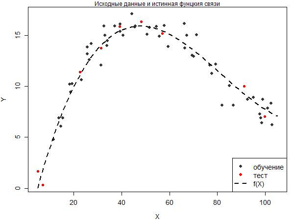

В качестве модели используем сплайны со степенями свободы от 2 (прямая) до 40 (количесество узлов равно 2/3 наблюдений). Строим модели с различным количеством степеней свободы, и в каждом случае считаем среднеквадратическую ошибку модели на обучающей и тестовой выборках.

Выведем первые десять строчек таблицы с моделями.


```{r create_model_various_degrees}
max.df <- 40  # max number of degrees of freedom for spline model

tbl <- data.frame(df = 2 : max.df)  # table to write errors
tbl$MSE.train <- 0  # column with errors based on education selection
tbl$MSE.test <- 0 # column with errors based on testing selection

# cycle on degrees of freedom
for (i in 2 : max.df) {
  mod <- smooth.spline(x = x.train, y = y.train, df = i)  # build model
  
  # model values for calculation errors of education and testing selections
  y.model.train <- predict(mod, data.frame(x = x.train))$y[, 1]
  y.model.test <- predict(mod, data.frame(x = x.test))$y[, 1]
  
  # calculation standard deviation from education and testing selections
  MSE <- c(sum((y.train - y.model.train) ^ 2) / length(x.train),
           sum((y.test - y.model.test) ^ 2) / length(x.test))
  
  tbl[tbl$df == i, c('MSE.train', 'MSE.test')] <- MSE  # write error to table
}

knitr::kable(head(tbl, n = 10))  # print first lines of table
```

Изобразим на графике поведение ошибок при различном количестве степеней свободы.

```{r dependence_MSE_flex_model_plot}
# save plot to file with png format
png(filename = 'MSE_model_flexibility_plot_1.png', width = 600, height = 450,
    units = 'px', pointsize = 12, res = NA)

# plot of dependence MSE from model flexibility
plot(x = tbl$df, y = tbl$MSE.test,
     type = 'l', col = 'red', lwd = 2,
     xlab = 'Степени свободы сплайна', ylab = 'MSE',
     ylim = c(min(tbl$MSE.train, tbl$MSE.test),
              max(tbl$MSE.train, tbl$MSE.test)),
     cex = 1.2, cex.lab = 1.2, cex.axis = 1.2)

mtext('Изменение MSE с ростом числа степеней свободы', side = 3)  # title of plot

# points on plot
points(x = tbl$df, y = tbl$MSE.test,
      pch = 21, col = 'red', bg = 'red')

# function on plot
lines(x = tbl$df, y = tbl$MSE.train, col = grey(0.3), lwd = 2)  # lines on plot

# fatal errors
abline(h = res.sd, lty = 2, col = grey(0.4), lwd = 2)

# legend
legend('topright', legend = c('обучающая', 'тестовая'),
       pch = c(NA, 16),
       col = c(grey(0.2), 'red'),
       lty = c(1, 1), lwd = c(2, 2), cex = 1.2)

# degrees of freedom of minimum testing selection error 
min.MSE.test <- min(tbl$MSE.test)
df.min.MSE.test <- tbl[tbl$MSE.test == min.MSE.test, 'df']

# trade-off between accuracy and simplicity of the model on schedule
df.my.MSE.test <- 17
my.MSE.test <- tbl[tbl$df == df.my.MSE.test, 'MSE.test']

# add dot to plot
abline(v = df.my.MSE.test,
       lty = 2, lwd = 2)

points(x = df.my.MSE.test, y = my.MSE.test,
       pch = 15, col = 'blue')

mtext(df.my.MSE.test,
      side = 1, line = -1, at = df.my.MSE.test, col = 'blue', cex = 1.2)

# end of input stream in file
invisible(dev.off())
```
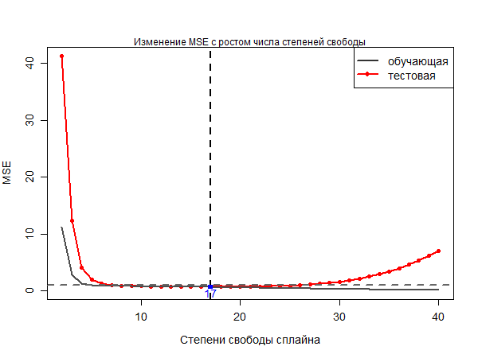

На этом графике:

*   При движении слева направо MSE на обучающей выборке (серая кривая) сокращается, так как с ростом числа степеней свободы растет число узлов, по которым строится сплайн. При этом модельная кривая подгоняется по все возрастающему количеству точек и становится все более гибкой. В результате индивидуальные расстояния от фактических наблюдений за $Y$ до их модельных оценок сокращаются, что приводит к сокращению MSE.

*   При движении слева направо, MSE на тестовой выборке (красная кривая) сначала резко сокращается, затем растет. Нам известна истинная форма связи $Y$ с $X$, она описывается кубической функцией. Число степеней свободы такой модели равно числу оцениваемых параметров, то есть четырем (коэффициенты перед $X$, $X^2$, $X^3$ и константа). Поэтому резкое падение ошибки на тестовой выборке при небольшом числе степеней свободы связано с тем, что модель приближается по гибкости к истинной функции связи. Затем MSE на тестовой выборке довольно долго остается стабильной, а после, начинает расти. Этот рост объясняется эффектом переобучения модели: она все лучше описывает обучающую выборку, и при этом постепенно становится неприменимой ни к одному другому набору наблюдений.

Наименьшее значение MSE на тестовой выборке соответствует числу степеней свободы 18, и равно 0.6703458 Визуально по графику мы можем установить, что первое значение $MSE_{ТЕСТ}$, близкое к стабильно низким, соответсвует $df = 17$. Ошибка здесь меньше единицы, что ненамного отличается от минимума. Именно $df = 17$ было выбрано в качестве компромисса между точность. (минимальное MSE на тестовой выборке) и простотой модели (чем меньше степеней свободы, тем модель проще).

График с моделью, выбранной в качестве лучшей, показан на рисунке ниже.

```{r best_model}
# save plot to file with png format
png(filename = 'plot_of_best_model_1.png', width = 600, height = 450,
    units = 'px', pointsize = 12, res = NA)

mod.MSE.test <- smooth.spline(x = x.train, y = y.train, df = df.my.MSE.test)

# for smooth model plots
x.model.plot <- seq(x.min, x.max, length = 250)
y.model.plot <- predict(mod.MSE.test, data.frame(x = x.model.plot))$y[, 1]

par(mar = c(4, 4, 1, 1))  # remove wide fields

# min and max values on axis
x.lim <- c(x.min, x.max)
y.lim <- c(min(y), max(y))

# observations with noises (education selection)
plot(x.train, y.train,
     col = grey(0.2), bg = grey(0.2), pch = 21,
     xlab = 'X', ylab = 'Y', xlim = x.lim, ylim = y.lim,
     cex = 1.2, cex.lab = 1.2, cex.axis = 1.2)

mtext('Исходные данные и лучшая модель', side = 3)  # plot title

points(x.test, y.test, col = 'red', bg = 'red', pch = 21) # observations of testing selection

# truth function on plot
lines(x.line, y.line, lwd = 2, lty = 2) # true 

# model on plot
lines(x.model.plot, y.model.plot,
      lwd = 2, col = 'blue')
# legend on plot
legend('bottom', legend = c('обучение', 'тест', 'f(x)', 'модель'),
       pch = c(16, 16, NA, NA),
       col = c(grey(0.2), 'red', 'black', 'blue'),
       lty = c(0, 0, 2, 1), lwd = c(1, 1, 2, 2), cex = 1.2)

# end of input stream in file
invisible(dev.off())
```
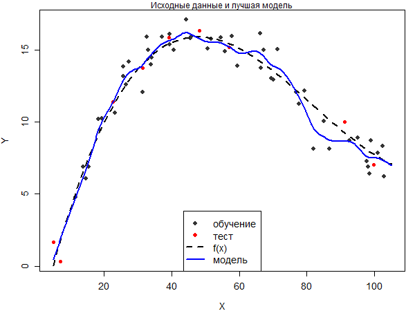

# Задача №2

Необходимо проделать действия из "Задачи №1" с условием, что в трех испытаниях $n = 300$, $n = 250$ и $n = 200$ соответсвенно.

## 1) $n = 300$

```{r data_generation_n_300}
# data generation
my.seed <- 8  # kernel
n.all <- 300 # all observations
train.percent <- 0.85 # percentage of education selection
res.sd <- 1 # standard deviation of random noise
x.min <- 5  # min boundary of X
x.max <- 105  # max boundary of X

set.seed(my.seed)
x <- runif(x.min, x.max, n = n.all)  # actual X value

set.seed(my.seed)
res <- rnorm(mean = 0, sd = res.sd, n = n.all)  # random noise

set.seed(my.seed)
inTrain <- sample(seq_along(x), size = train.percent * n.all) # take values for education selection

y.func <- function(x) {15 + 0.02 * x - 0.005 * (x - 45) ^ 2 + 0.00006 * (x - 54) ^ 3} # true interconnection function

# lines for true relationship plot
x.line <- seq(x.min, x.max, length = n.all)
y.line <- y.func(x.line)

y <- y.func(x) + res # actual y value with noises

# create vectors with data for plots

# observations based on an education selection
x.train <- x[inTrain]
y.train <- y[inTrain]

# observations based on a testing selection
x.test <- x[-inTrain]
y.test <- y[-inTrain]
```

Изобразим исходные данные на графике:

```{r true_relationship_plot_n_300}
# save plot to file with png format
png(filename = 'true_relationship_plot_2_1.png', width = 600, height = 450, 
    units = 'px', pointsize = 12, res = NA)

par(mar = c(4, 4, 1, 1)) # remove wide fields

# min and max observations on axis
x.lim <- c(x.min, x.max)
y.lim <- c(min(y), max(y))

# plot of observations with noises
x = plot(x.train, y.train,
     col = grey(0.2), bg = grey(0.2), pch = 21,
     xlab = 'X', ylab = 'Y',
     xlim = x.lim, ylim = y.lim,
     cex = 1.2, cex.lab = 1.2, cex.axis = 1.2)

mtext('Исходные данные и истинная фунцкия связи', side = 3) # plot title

points(x.test, y.test, col = 'red', bg = 'red', pch = 21) # observations of test selection

lines(x.line, y.line, lwd = 2, lty = 2) # true relationship function

# legend
legend('bottomright', legend = c('обучение', 'тест', 'f(X)'),
      pch = c(16, 16, NA),
      col = c(grey(0.2), 'red', 'black'),
      lty = c(0, 0, 2), lwd = c(1, 1, 2),
      cex = 1.2)

# end of input stream in file
invisible(dev.off())
```
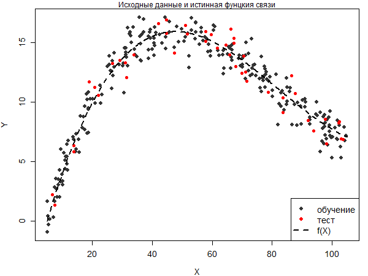

Выведем первые десять строчек таблицы с моделями.


```{r create_model_various_degrees_n_300}
max.df <- 40  # max number of degrees of freedom for spline model

tbl <- data.frame(df = 2 : max.df)  # table to write errors
tbl$MSE.train <- 0  # column with errors based on education selection
tbl$MSE.test <- 0 # column with errors based on testing selection

# cycle on degrees of freedom
for (i in 2 : max.df) {
  mod <- smooth.spline(x = x.train, y = y.train, df = i)  # build model
  
  # model values for calculation errors of education and testing selections
  y.model.train <- predict(mod, data.frame(x = x.train))$y[, 1]
  y.model.test <- predict(mod, data.frame(x = x.test))$y[, 1]
  
  # calculation standard deviation from education and testing selections
  MSE <- c(sum((y.train - y.model.train) ^ 2) / length(x.train),
           sum((y.test - y.model.test) ^ 2) / length(x.test))
  
  tbl[tbl$df == i, c('MSE.train', 'MSE.test')] <- MSE  # write error to table
}

knitr::kable(head(tbl, n = 10))  # print first lines of table
```

Изобразим на графике поведение ошибок при различном количестве степеней свободы.

```{r dependence_MSE_flex_model_plot_n_300}
# save plot to file with png format
png(filename = 'MSE_model_flexibility_plot_2_1.png', width = 600, height = 450,
    units = 'px', pointsize = 12, res = NA)

# plot of dependence MSE from model flexibility
plot(x = tbl$df, y = tbl$MSE.test,
     type = 'l', col = 'red', lwd = 2,
     xlab = 'Степени свободы сплайна', ylab = 'MSE',
     ylim = c(min(tbl$MSE.train, tbl$MSE.test),
              max(tbl$MSE.train, tbl$MSE.test)),
     cex = 1.2, cex.lab = 1.2, cex.axis = 1.2)

mtext('Изменение MSE с ростом числа степеней свободы', side = 3)  # title of plot

# points on plot
points(x = tbl$df, y = tbl$MSE.test,
      pch = 21, col = 'red', bg = 'red')

# function on plot
lines(x = tbl$df, y = tbl$MSE.train, col = grey(0.3), lwd = 2)  # lines on plot

# fatal errors
abline(h = res.sd, lty = 2, col = grey(0.4), lwd = 2)

# legend
legend('topright', legend = c('обучающая', 'тестовая'),
       pch = c(NA, 16),
       col = c(grey(0.2), 'red'),
       lty = c(1, 1), lwd = c(2, 2), cex = 1.2)

# degrees of freedom of minimum testing selection error 
min.MSE.test <- min(tbl$MSE.test)
df.min.MSE.test <- tbl[tbl$MSE.test == min.MSE.test, 'df']

# trade-off between accuracy and simplicity of the model on schedule
df.my.MSE.test <- 8
my.MSE.test <- tbl[tbl$df == df.my.MSE.test, 'MSE.test']

# add dot to plot
abline(v = df.my.MSE.test,
       lty = 2, lwd = 2)

points(x = df.my.MSE.test, y = my.MSE.test,
       pch = 15, col = 'blue')

mtext(df.my.MSE.test,
      side = 1, line = -2, at = df.my.MSE.test, col = 'blue', cex = 1.2)

# end of input stream in file
invisible(dev.off())
```
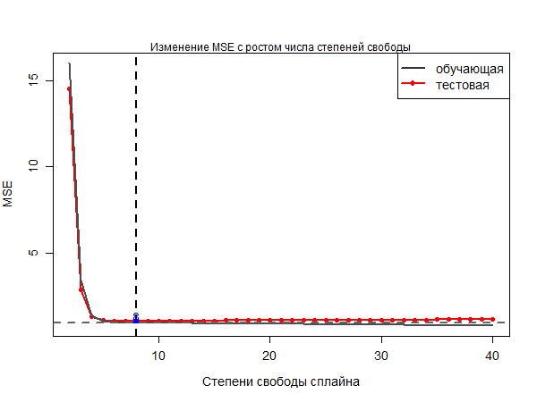

График с моделью, выбранной в качестве лучшей, показан на рисунке ниже.

```{r best_model_n_300}
# save plot to file with png format
png(filename = 'plot_of_best_model_2_1.png', width = 600, height = 450,
    units = 'px', pointsize = 12, res = NA)

mod.MSE.test <- smooth.spline(x = x.train, y = y.train, df = df.my.MSE.test)

# for smooth model plots
x.model.plot <- seq(x.min, x.max, length = 250)
y.model.plot <- predict(mod.MSE.test, data.frame(x = x.model.plot))$y[, 1]

par(mar = c(4, 4, 1, 1))  # remove wide fields

# min and max values on axis
x.lim <- c(x.min, x.max)
y.lim <- c(min(y), max(y))

# observations with noises (education selection)
plot(x.train, y.train,
     col = grey(0.2), bg = grey(0.2), pch = 21,
     xlab = 'X', ylab = 'Y', xlim = x.lim, ylim = y.lim,
     cex = 1.2, cex.lab = 1.2, cex.axis = 1.2)

mtext('Исходные данные и лучшая модель', side = 3)  # plot title

points(x.test, y.test, col = 'red', bg = 'red', pch = 21) # observations of testing selection

# truth function on plot
lines(x.line, y.line, lwd = 2, lty = 2) # true 

# model on plot
lines(x.model.plot, y.model.plot,
      lwd = 2, col = 'blue')
# legend on plot
legend('bottom', legend = c('обучение', 'тест', 'f(x)', 'модель'),
       pch = c(16, 16, NA, NA),
       col = c(grey(0.2), 'red', 'black', 'blue'),
       lty = c(0, 0, 2, 1), lwd = c(1, 1, 2, 2), cex = 1.2)

# end of input stream in file
invisible(dev.off())
```
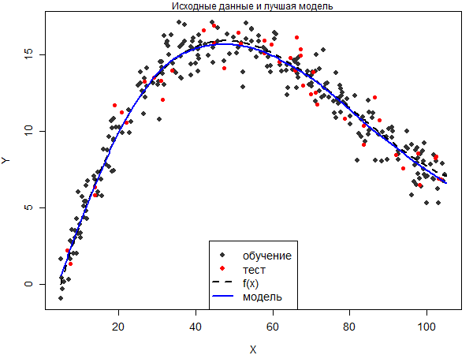

## 2) $n = 250$

```{r data_generation_n_250}
# data generation
my.seed <- 8  # kernel
n.all <- 250 # all observations
train.percent <- 0.85 # percentage of education selection
res.sd <- 1 # standard deviation of random noise
x.min <- 5  # min boundary of X
x.max <- 105  # max boundary of X

set.seed(my.seed)
x <- runif(x.min, x.max, n = n.all)  # actual X value

set.seed(my.seed)
res <- rnorm(mean = 0, sd = res.sd, n = n.all)  # random noise

set.seed(my.seed)
inTrain <- sample(seq_along(x), size = train.percent * n.all) # take values for education selection

y.func <- function(x) {15 + 0.02 * x - 0.005 * (x - 45) ^ 2 + 0.00006 * (x - 54) ^ 3} # true interconnection function

# lines for true relationship plot
x.line <- seq(x.min, x.max, length = n.all)
y.line <- y.func(x.line)

y <- y.func(x) + res # actual y value with noises

# create vectors with data for plots

# observations based on an education selection
x.train <- x[inTrain]
y.train <- y[inTrain]

# observations based on a testing selection
x.test <- x[-inTrain]
y.test <- y[-inTrain]
```

Изобразим исходные данные на графике:

```{r true_relationship_plot_n_250}
# save plot to file with png format
png(filename = 'true_relationship_plot_2_2.png', width = 600, height = 450, 
    units = 'px', pointsize = 12, res = NA)

par(mar = c(4, 4, 1, 1)) # remove wide fields

# min and max observations on axis
x.lim <- c(x.min, x.max)
y.lim <- c(min(y), max(y))

# plot of observations with noises
x = plot(x.train, y.train,
     col = grey(0.2), bg = grey(0.2), pch = 21,
     xlab = 'X', ylab = 'Y',
     xlim = x.lim, ylim = y.lim,
     cex = 1.2, cex.lab = 1.2, cex.axis = 1.2)

mtext('Исходные данные и истинная фунцкия связи', side = 3) # plot title

points(x.test, y.test, col = 'red', bg = 'red', pch = 21) # observations of test selection

lines(x.line, y.line, lwd = 2, lty = 2) # true relationship function

# legend
legend('bottomright', legend = c('обучение', 'тест', 'f(X)'),
      pch = c(16, 16, NA),
      col = c(grey(0.2), 'red', 'black'),
      lty = c(0, 0, 2), lwd = c(1, 1, 2),
      cex = 1.2)

# end of input stream in file
invisible(dev.off())
```
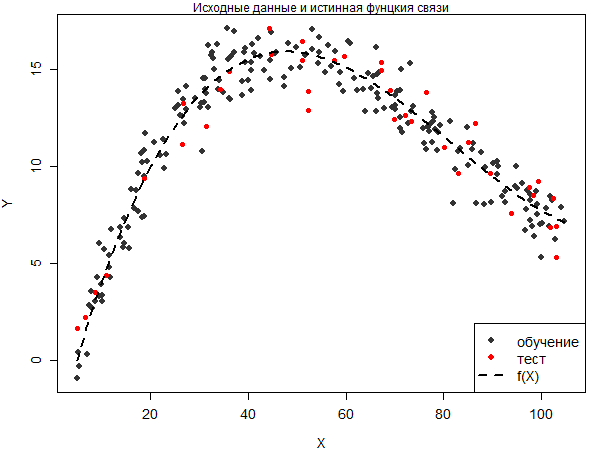

Выведем первые десять строчек таблицы с моделями.


```{r create_model_various_degrees_n_250}
max.df <- 40  # max number of degrees of freedom for spline model

tbl <- data.frame(df = 2 : max.df)  # table to write errors
tbl$MSE.train <- 0  # column with errors based on education selection
tbl$MSE.test <- 0 # column with errors based on testing selection

# cycle on degrees of freedom
for (i in 2 : max.df) {
  mod <- smooth.spline(x = x.train, y = y.train, df = i)  # build model
  
  # model values for calculation errors of education and testing selections
  y.model.train <- predict(mod, data.frame(x = x.train))$y[, 1]
  y.model.test <- predict(mod, data.frame(x = x.test))$y[, 1]
  
  # calculation standard deviation from education and testing selections
  MSE <- c(sum((y.train - y.model.train) ^ 2) / length(x.train),
           sum((y.test - y.model.test) ^ 2) / length(x.test))
  
  tbl[tbl$df == i, c('MSE.train', 'MSE.test')] <- MSE  # write error to table
}

knitr::kable(head(tbl, n = 10))  # print first lines of table
```

Изобразим на графике поведение ошибок при различном количестве степеней свободы.

```{r dependence_MSE_flex_model_plot_n_250}
# save plot to file with png format
png(filename = 'MSE_model_flexibility_plot_2_2.png', width = 600, height = 450,
    units = 'px', pointsize = 12, res = NA)

# plot of dependence MSE from model flexibility
plot(x = tbl$df, y = tbl$MSE.test,
     type = 'l', col = 'red', lwd = 2,
     xlab = 'Степени свободы сплайна', ylab = 'MSE',
     ylim = c(min(tbl$MSE.train, tbl$MSE.test),
              max(tbl$MSE.train, tbl$MSE.test)),
     cex = 1.2, cex.lab = 1.2, cex.axis = 1.2)

mtext('Изменение MSE с ростом числа степеней свободы', side = 3)  # title of plot

# points on plot
points(x = tbl$df, y = tbl$MSE.test,
      pch = 21, col = 'red', bg = 'red')

# function on plot
lines(x = tbl$df, y = tbl$MSE.train, col = grey(0.3), lwd = 2)  # lines on plot

# fatal errors
abline(h = res.sd, lty = 2, col = grey(0.4), lwd = 2)

# legend
legend('topright', legend = c('обучающая', 'тестовая'),
       pch = c(NA, 16),
       col = c(grey(0.2), 'red'),
       lty = c(1, 1), lwd = c(2, 2), cex = 1.2)

# degrees of freedom of minimum testing selection error 
min.MSE.test <- min(tbl$MSE.test)
df.min.MSE.test <- tbl[tbl$MSE.test == min.MSE.test, 'df']

# trade-off between accuracy and simplicity of the model on schedule
df.my.MSE.test <- 5
my.MSE.test <- tbl[tbl$df == df.my.MSE.test, 'MSE.test']

# add dot to plot
abline(v = df.my.MSE.test,
       lty = 2, lwd = 2)

points(x = df.my.MSE.test, y = my.MSE.test,
       pch = 15, col = 'blue')

mtext(df.my.MSE.test,
      side = 1, line = -1, at = df.my.MSE.test, col = 'blue', cex = 1.2)

# end of input stream in file
invisible(dev.off())
```
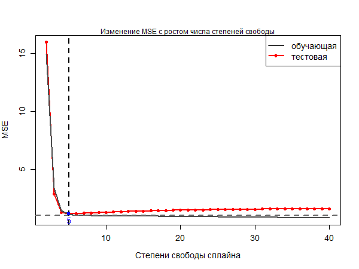

График с моделью, выбранной в качестве лучшей, показан на рисунке ниже.

```{r best_model_n_250}
# save plot to file with png format
png(filename = 'plot_of_best_model_2_2.png', width = 600, height = 450,
    units = 'px', pointsize = 12, res = NA)

mod.MSE.test <- smooth.spline(x = x.train, y = y.train, df = df.my.MSE.test)

# for smooth model plots
x.model.plot <- seq(x.min, x.max, length = 250)
y.model.plot <- predict(mod.MSE.test, data.frame(x = x.model.plot))$y[, 1]

par(mar = c(4, 4, 1, 1))  # remove wide fields

# min and max values on axis
x.lim <- c(x.min, x.max)
y.lim <- c(min(y), max(y))

# observations with noises (education selection)
plot(x.train, y.train,
     col = grey(0.2), bg = grey(0.2), pch = 21,
     xlab = 'X', ylab = 'Y', xlim = x.lim, ylim = y.lim,
     cex = 1.2, cex.lab = 1.2, cex.axis = 1.2)

mtext('Исходные данные и лучшая модель', side = 3)  # plot title

points(x.test, y.test, col = 'red', bg = 'red', pch = 21) # observations of testing selection

# truth function on plot
lines(x.line, y.line, lwd = 2, lty = 2) # true 

# model on plot
lines(x.model.plot, y.model.plot,
      lwd = 2, col = 'blue')
# legend on plot
legend('bottom', legend = c('обучение', 'тест', 'f(x)', 'модель'),
       pch = c(16, 16, NA, NA),
       col = c(grey(0.2), 'red', 'black', 'blue'),
       lty = c(0, 0, 2, 1), lwd = c(1, 1, 2, 2), cex = 1.2)

# end of input stream in file
invisible(dev.off())
```
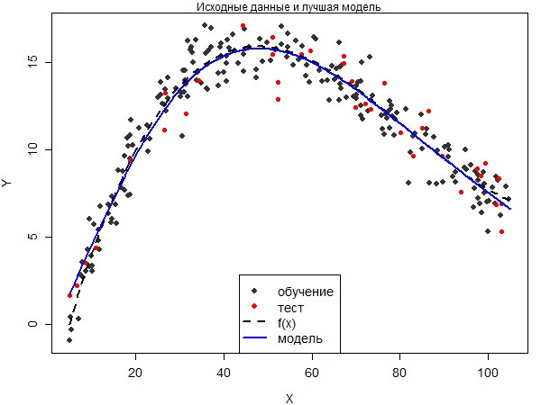

## 3) $n = 200$

```{r data_generation_n_200}
# data generation
my.seed <- 8  # kernel
n.all <- 200 # all observations
train.percent <- 0.85 # percentage of education selection
res.sd <- 1 # standard deviation of random noise
x.min <- 5  # min boundary of X
x.max <- 105  # max boundary of X

set.seed(my.seed)
x <- runif(x.min, x.max, n = n.all)  # actual X value

set.seed(my.seed)
res <- rnorm(mean = 0, sd = res.sd, n = n.all)  # random noise

set.seed(my.seed)
inTrain <- sample(seq_along(x), size = train.percent * n.all) # take values for education selection

y.func <- function(x) {15 + 0.02 * x - 0.005 * (x - 45) ^ 2 + 0.00006 * (x - 54) ^ 3} # true interconnection function

# lines for true relationship plot
x.line <- seq(x.min, x.max, length = n.all)
y.line <- y.func(x.line)

y <- y.func(x) + res # actual y value with noises

# create vectors with data for plots

# observations based on an education selection
x.train <- x[inTrain]
y.train <- y[inTrain]

# observations based on a testing selection
x.test <- x[-inTrain]
y.test <- y[-inTrain]
```

Изобразим исходные данные на графике:

```{r true_relationship_plot_n_200}
# save plot to file with png format
png(filename = 'true_relationship_plot_2_3.png', width = 600, height = 450, 
    units = 'px', pointsize = 12, res = NA)

par(mar = c(4, 4, 1, 1)) # remove wide fields

# min and max observations on axis
x.lim <- c(x.min, x.max)
y.lim <- c(min(y), max(y))

# plot of observations with noises
x = plot(x.train, y.train,
     col = grey(0.2), bg = grey(0.2), pch = 21,
     xlab = 'X', ylab = 'Y',
     xlim = x.lim, ylim = y.lim,
     cex = 1.2, cex.lab = 1.2, cex.axis = 1.2)

mtext('Исходные данные и истинная фунцкия связи', side = 3) # plot title

points(x.test, y.test, col = 'red', bg = 'red', pch = 21) # observations of test selection

lines(x.line, y.line, lwd = 2, lty = 2) # true relationship function

# legend
legend('bottomright', legend = c('обучение', 'тест', 'f(X)'),
      pch = c(16, 16, NA),
      col = c(grey(0.2), 'red', 'black'),
      lty = c(0, 0, 2), lwd = c(1, 1, 2),
      cex = 1.2)

# end of input stream in file
invisible(dev.off())
```
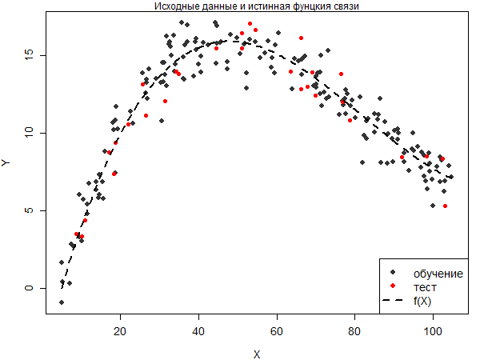

Выведем первые десять строчек таблицы с моделями.


```{r create_model_various_degrees_n_200}
max.df <- 40  # max number of degrees of freedom for spline model

tbl <- data.frame(df = 2 : max.df)  # table to write errors
tbl$MSE.train <- 0  # column with errors based on education selection
tbl$MSE.test <- 0 # column with errors based on testing selection

# cycle on degrees of freedom
for (i in 2 : max.df) {
  mod <- smooth.spline(x = x.train, y = y.train, df = i)  # build model
  
  # model values for calculation errors of education and testing selections
  y.model.train <- predict(mod, data.frame(x = x.train))$y[, 1]
  y.model.test <- predict(mod, data.frame(x = x.test))$y[, 1]
  
  # calculation standard deviation from education and testing selections
  MSE <- c(sum((y.train - y.model.train) ^ 2) / length(x.train),
           sum((y.test - y.model.test) ^ 2) / length(x.test))
  
  tbl[tbl$df == i, c('MSE.train', 'MSE.test')] <- MSE  # write error to table
}

knitr::kable(head(tbl, n = 10))  # print first lines of table
```

Изобразим на графике поведение ошибок при различном количестве степеней свободы.

```{r dependence_MSE_flex_model_plot_n_200}
# save plot to file with png format
png(filename = 'MSE_model_flexibility_plot_2_3.png', width = 600, height = 450,
    units = 'px', pointsize = 12, res = NA)

# plot of dependence MSE from model flexibility
plot(x = tbl$df, y = tbl$MSE.test,
     type = 'l', col = 'red', lwd = 2,
     xlab = 'Степени свободы сплайна', ylab = 'MSE',
     ylim = c(min(tbl$MSE.train, tbl$MSE.test),
              max(tbl$MSE.train, tbl$MSE.test)),
     cex = 1.2, cex.lab = 1.2, cex.axis = 1.2)

mtext('Изменение MSE с ростом числа степеней свободы', side = 3)  # title of plot

# points on plot
points(x = tbl$df, y = tbl$MSE.test,
      pch = 21, col = 'red', bg = 'red')

# function on plot
lines(x = tbl$df, y = tbl$MSE.train, col = grey(0.3), lwd = 2)  # lines on plot

# fatal errors
abline(h = res.sd, lty = 2, col = grey(0.4), lwd = 2)

# legend
legend('topright', legend = c('обучающая', 'тестовая'),
       pch = c(NA, 16),
       col = c(grey(0.2), 'red'),
       lty = c(1, 1), lwd = c(2, 2), cex = 1.2)

# degrees of freedom of minimum testing selection error 
min.MSE.test <- min(tbl$MSE.test)
df.min.MSE.test <- tbl[tbl$MSE.test == min.MSE.test, 'df']

# trade-off between accuracy and simplicity of the model on schedule
df.my.MSE.test <- 5
my.MSE.test <- tbl[tbl$df == df.my.MSE.test, 'MSE.test']

# add dot to plot
abline(v = df.my.MSE.test,
       lty = 2, lwd = 2)

points(x = df.my.MSE.test, y = my.MSE.test,
       pch = 15, col = 'blue')

mtext(df.my.MSE.test,
      side = 1, line = -1, at = df.my.MSE.test, col = 'blue', cex = 1.2)

# end of input stream in file
invisible(dev.off())
```
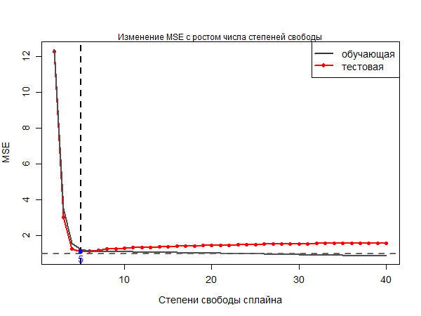

График с моделью, выбранной в качестве лучшей, показан на рисунке ниже.

```{r best_model_n_200}
# save plot to file with png format
png(filename = 'plot_of_best_model_2_3.png', width = 600, height = 450,
    units = 'px', pointsize = 12, res = NA)

mod.MSE.test <- smooth.spline(x = x.train, y = y.train, df = df.my.MSE.test)

# for smooth model plots
x.model.plot <- seq(x.min, x.max, length = 250)
y.model.plot <- predict(mod.MSE.test, data.frame(x = x.model.plot))$y[, 1]

par(mar = c(4, 4, 1, 1))  # remove wide fields

# min and max values on axis
x.lim <- c(x.min, x.max)
y.lim <- c(min(y), max(y))

# observations with noises (education selection)
plot(x.train, y.train,
     col = grey(0.2), bg = grey(0.2), pch = 21,
     xlab = 'X', ylab = 'Y', xlim = x.lim, ylim = y.lim,
     cex = 1.2, cex.lab = 1.2, cex.axis = 1.2)

mtext('Исходные данные и лучшая модель', side = 3)  # plot title

points(x.test, y.test, col = 'red', bg = 'red', pch = 21) # observations of testing selection

# truth function on plot
lines(x.line, y.line, lwd = 2, lty = 2) # true 

# model on plot
lines(x.model.plot, y.model.plot,
      lwd = 2, col = 'blue')
# legend on plot
legend('bottom', legend = c('обучение', 'тест', 'f(x)', 'модель'),
       pch = c(16, 16, NA, NA),
       col = c(grey(0.2), 'red', 'black', 'blue'),
       lty = c(0, 0, 2, 1), lwd = c(1, 1, 2, 2), cex = 1.2)

# end of input stream in file
invisible(dev.off())
```
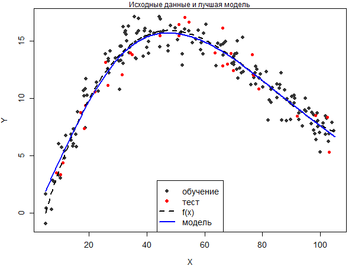

# Вывод:

Выше описаны аналогичные действия и графики как в "Задачи №1". Как видно из графиков, при увеличении n (количества наблюдений) в общем плане уменьшаеться $MSE_{ТЕСТ}$ при увеличении степеней свободы. В "Задаче №1" $MSE_{ТЕСТ}$ стремительно начинает расти при $df = 21$ ($>= 0.7251839$).Также при увеличении количества наблюдений растет и среднее значение $MSE_{ТЕСТ}$ при обучении. Так минимальное значение $MSE_{ТЕСТ}$ достигается при меньших степенях свободы, но само значение выше: при $n = 300$ $df = 8$, а $MSE_{ТЕСТ} = 1.058075$; при $n = 250$ $df = 5$, $MSE_{ТЕСТ} = 1.150162$; при $n = 200$ $df = 5$, $MSE_{ТЕСТ} = 1.111070$, - в "Задачи №1" минимальное значение $MSE_{ТЕСТ}$ равно 0.6703458 при $df = 17$.