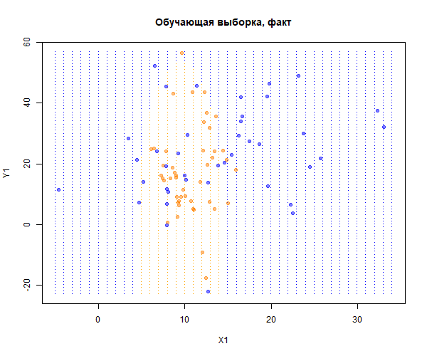
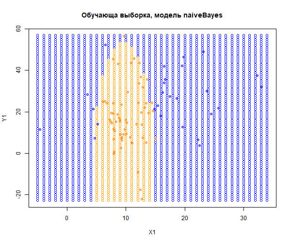
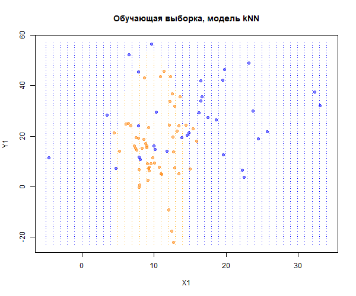

```{r setup, include=FALSE}
library(knitr)
library(class)  # for function knn()
library(e1071)  # for function naiveBayes()
library(MASS)  # for function mvrn
library(emdbook) # for function dmvnorm()
knitr::opts_chunk$set(echo = FALSE)
```

# Задача 1

Необходимо построить модели на данных **третьего примера** с параметрами распределения:

*   x1.mean.y0 = 12;
*   x2.mean.y0 = 23;
*   x1.sd.y0 = 7;
*   x2.sd.y0 = 15;
*   x1.mean.y1 = 10;
*   x2.mean.y1 = 19;
*   x1.sd.y1 = 3;
*   x2.sd.y1 = 14.

```{r data_generation}
my.seed <- 8  # generation kernel

n <- 100 # number of observations

# mean for y0 and y1
x1.mean.y0 <- 12
x2.mean.y0 <- 23
x1.mean.y1 <- 10
x2.mean.y1 <- 19

# covariance matrix for y0 and y1
x1.sd.y0 = 7
x2.sd.y0 = 15
x1.sd.y1 = 3
x2.sd.y1 = 14

y0_values <- c(x1.mean.y0, x2.mean.y0) # vector with mean values for y0
y1_values <- c(x1.mean.y1, x2.mean.y1) # vector with mean values for y1

train.percent <- 0.85 # percent of train selection

set.seed(my.seed) # set seed kernel 

# generate y0
class.0 <- mvrnorm(45, mu = y0_values, Sigma = matrix(c(x1.sd.y0^2, 0, 0, x2.sd.y0^2), 2, 2, byrow = T))

set.seed(my.seed + 1) # set new seed kernel

# generate y1
class.1 <- mvrnorm(55, mu = y1_values, Sigma = matrix(c(x1.sd.y1^2, 0, 0, x2.sd.y1^2), 2, 2, byrow = T))

x1 <- c(class.0[, 1], class.1[, 1]) # make vector with x1 values from both classes
x2 <- c(class.0[, 2], class.1[, 2]) # make vector with x2 values from both classes

y <- c(rep(0, nrow(class.0)), rep(1, nrow(class.1))) # actually the classes Y

# classes for observing the grid
rules.mv <- function(v.x, v.mean.y0, v.mean.y1, m.sigma.y0, m.sigma.y1) {
  ifelse(dmvnorm(v.x, v.mean.y0, m.sigma.y0) > dmvnorm(v.x, v.mean.y1, m.sigma.y1), 0, 1)
}
```

Получим:

$n =$ `r n`, при этом доля обучающей выборки равна `r train.percent`;
$$Y = 0: X \sim N(`r x1.mean.y0`, `r x2.mean.y0`), \begin{pmatrix}`r x1.sd.y0`^2 & 0\\ 0 & `r x2.sd.y0`^2 \end{pmatrix}$$
$$Y = 0: X \sim N(`r x1.mean.y1`, `r x2.mean.y1`), \begin{pmatrix}`r x1.sd.y1`^2 & 0\\ 0 & `r x2.sd.y1`^2 \end{pmatrix}$$
```{r select_train_set_data}
set.seed(my.seed) # set seed kernel

# select data for training
inTrain <- sample(seq_along(x1), train.percent * n)
x1.train <- x1[inTrain]
x2.train <- x2[inTrain]
x1.test <- x1[-inTrain]
x2.test <- x2[-inTrain]

# actual classes
y.train <- y[inTrain]
y.test <- y[-inTrain]

df.train.1 <- data.frame(x1 = x1.train, x2 = x2.train, y = y.train) # train set
df.test.1 <- data.frame(x1 = x1.test, x2 = x2.test) # test set
```

Покажем обучающую выборку на графике. Сеткой точек показаны области классов, соответсвующие истинным дискриминирующим правилам. Это правило создаем, зная истинные законы распределения классов, как максиммум из двух плотностей распределения.

```{r learn_set_plot}
png('learn_set_plot.png', width = 600, height = 500) # save plot to file

# grid of true class areas
x1.grid <- rep(seq(floor(min(x1)), ceiling(max(x1)), by = 1), ceiling(max(x2)) - floor(min(x2)) + 1)
x2.grid <- rep(seq(floor(min(x2)), ceiling(max(x2)), by = 1), ceiling(max(x1)) - floor(min(x1)) + 1)

# observations class for grid
y.grid <- rules.mv(as.matrix(cbind(x1.grid, x2.grid)), 
                   y0_values, y1_values,
                   matrix(c(x1.sd.y0 ^ 2, 0, 0, x2.sd.y0 ^ 2), 2, 2, byrow = T),
                   matrix(c(x1.sd.y1 ^ 2, 0, 0, x2.sd.y1 ^ 2), 2, 2, byrow = T))

df.grid.1 <- data.frame(x1 = x1.grid, x2 = x2.grid, y = y.grid) # frame for grid

# appearance of plot
cls <- c('blue', 'orange')
cls.t <- c(rgb(0, 0, 1, alpha = 0.5), rgb(1, 0.5, 0, alpha = 0.5))

# true class plot
plot(df.grid.1$x1, df.grid.1$x2,
     pch = '.', col = cls[df.grid.1[, 'y'] + 1],
     xlab = 'X1', ylab = 'Y1',
     main = 'Обучающая выборка, факт')

# points on plot
points(df.train.1$x1, df.train.1$x2,
      pch = 21, bg = cls.t[df.train.1[, 'y'] + 1],
      col = cls.t[df.train.1[, 'y'] + 1])
invisible(dev.off()) # close input flow to png() function
```


Обучим модель **наивного байесовского классификатор** и оценим ее точность (верность) на обучающей выборке. Поскольку объясняющие переменные для классов сгенерированы как двумерные нормальные распределения и сами классы не перекрываются, следует ожидать, что данная окажется точной. 

```{r naive_bayesian_classifier}
png('naive_bayesian_classifier.png', width = 600, height = 500) # save plot to file

nb <- naiveBayes(y ~ ., data = df.train.1) # make model

y.nb.train <- ifelse(predict(nb, df.train.1[, -3], type = 'raw')[, 2] > 0.5, 1, 0) # model values on train set as class

# true class plot
plot(df.grid.1$x1, df.grid.1$x2,
     phc = '.', col = cls[df.grid.1[, 'y'] + 1],
     xlab = 'X1', ylab = 'Y1',
     main = 'Обучающа выборка, модель naiveBayes')

# observations points on plot, predicted by model
points(df.train.1$x1, df.train.1$x2,
       pch = 21, bg = cls.t[y.nb.train + 1],
       col = cls.t[y.nb.train + 1])
invisible(dev.off()) # close input flow to png() function
```


Теперь построим матрицу неточностей на обучающей выборке:

```{r confusion_matrix_train_set_nb}
tbl_train_nb <- table(y.train, y.nb.train) # confusion matrix on train set
kable(tbl_train_nb) # print confusion matrix on train set
```

Также выведем точность (верность) на обучающей выборке:

```{r accuracy_train_set_nb}
Acc_train_nb <- sum(diag(tbl_train_nb)) / sum(tbl_train_nb) # accuracy train set
kable(Acc_train_nb) # print accuracy train set
```

Точность на обучающей выборке высокая, поэтому сделаем прогноз классов на тестовую выборку, а также оценим точность модели.

Матрица неточностей на тестовой выборке:

```{r confusion_matrix_test_set_nb}
y.nb.test <- ifelse(predict(nb, df.test.1, type = 'raw')[, 2] > 0.5, 1, 0) # predict on test set
tbl_test_nb <- table(y.test, y.nb.test) # confusion matrix on test set
kable(tbl_test_nb) # print confusion matrix on train set
```

Точность (верность) на тестовой выборке:

```{r accuracy_test_set_nb}
Acc_test_nb <- sum(diag(tbl_test_nb)) / sum(tbl_test_nb) # accuracy test set
kable(Acc_test_nb) # print accuracy test set
```

Наивный байесовский метод разделяет классы на обучающей выборке, ошибаясь в двух случаях.

Построим модель **kNN**. С этими данными у метода не должно возникнуть проблем, так как он не проводит четкой границы между классами, а в каждом случае ориентируется на соседние наблюдения.

```{r knn_method}
png('knn_method_plot.png', width = 600, height = 500) # save plot to file

# make model (k = 3)
y.knn.train <- knn(train = scale(df.train.1[, -3]),
                   test = scale(df.train.1[, -3]),
                   cl = df.train.1$y, k = 3)

# true class plot
plot(df.grid.1$x1, df.grid.1$x2,
     pch = '.', col = cls[df.grid.1[, 'y'] + 1],
     xlab = 'X1', ylab = 'Y1',
     main = 'Обучающая выборка, модель kNN')

# points on plot
points(df.train.1$x1, df.train.1$x2,
       pch = 21, bg = cls.t[as.numeric(y.knn.train)],
       col = cls.t[as.numeric(y.knn.train)])

invisible(dev.off()) # close input flow to png() function
```


Рассчитаем матрицу неточностей на обучающей выборке для метода **kNN**:

```{r confusion_matrix_train_set_knn}
tbl_train_knn <- table(y.train, y.knn.train) # confusion matrix on train set
kable(tbl_train_knn) # print confusion matrix on train set
```

Выведем точность (верность) на обучающей выборке для метода **kNN**:

```{r accuracy_train_set_knn}
Acc_train_knn <- sum(diag(tbl_train_knn)) / sum(tbl_train_knn) # accuracy on train set
kable(Acc_train_knn) # print accuracy on train set
```

Рассчитаем матрицу неточностей на тестовой выборке для метода **kNN**:

```{r confusion_matrix_test_set_knn}
# predict on test set (k= 3)
y.knn.test <- knn(train = scale(df.train.1[, -3]),
                  test = scale(df.test.1[, -3]),
                  cl = df.train.1$y, k = 3)

tbl_test_knn <- table(y.test, y.knn.test) # confusion matrix on train set
kable(tbl_test_knn) # print confusion matrix on train set
```

Выведем точность (верность) на тестовой выборке для метода **kNN**:

```{r accuracy_test_set_knn}
Acc_test_knn <- sum(diag(tbl_test_knn)) / sum(tbl_test_knn) # accuracy on test set
kable(Acc_test_knn) # print accuracy on test set
```

**Вывод:**

Как видно из точности обоих моделей, в обучащей выборке точность выше у kNN метода (`r Acc_train_knn` (kNN) > `r Acc_train_nb` (NB)), однако на тестовых выборках точность у обоих моделей равна (`r Acc_test_knn` (kNN) = `r Acc_test_nb`), при этом в обоих случаях точность довольно низкая, близко к 0.5. В качестве модели для последующих вычислений будет использоваться моделей kNN.

# Задача №2 

По матрице неточностей модели kNN рассчитать характеристики качеств и ошибки: TPR, SPC, PPV, NPV, FNR, FPR, FDR, MCC. Данные характеристики для обучающей и тестовой выборок приведены в таблице ниже.

```{r knn_method_features}
# features for train set
TPR_train <- tbl_train_knn[4] / (tbl_train_knn[4] + tbl_train_knn[2])
SPC_train <- tbl_train_knn[1] / (tbl_train_knn[1] + tbl_train_knn[3])
PPV_train <- tbl_train_knn[4] / (tbl_train_knn[4] + tbl_train_knn[3])
NPV_train <- tbl_train_knn[1] / (tbl_train_knn[1] + tbl_train_knn[2])
FNR_train <- 1 - TPR_train
FPR_train <- 1 - SPC_train
FDR_train <- 1 - PPV_train
MCC_train <- (tbl_train_knn[4] * tbl_train_knn[1] - tbl_train_knn[2] * tbl_train_knn[3]) / sqrt((tbl_train_knn[4] + tbl_train_knn[3]) * (tbl_train_knn[4] + tbl_train_knn[2]) * (tbl_train_knn[1] + tbl_train_knn[3]) * (tbl_train_knn[1] + tbl_train_knn[2]))

# features for test set
TPR_test <- tbl_test_knn[4] / (tbl_test_knn[4] + tbl_test_knn[2])
SPC_test <- tbl_test_knn[1] / (tbl_test_knn[1] + tbl_test_knn[3])
PPV_test <- tbl_test_knn[4] / (tbl_test_knn[4] + tbl_test_knn[3])
NPV_test <- tbl_test_knn[1] / (tbl_test_knn[1] + tbl_test_knn[2])
FNR_test <- 1 - TPR_test
FPR_test <- 1 - SPC_test
FDR_test <- 1 - PPV_test
MCC_test <- (tbl_test_knn[4] * tbl_test_knn[1] - tbl_test_knn[2] * tbl_test_knn[3]) / sqrt((tbl_test_knn[4] + tbl_test_knn[3]) * (tbl_test_knn[4] + tbl_test_knn[2]) * (tbl_test_knn[1] + tbl_test_knn[3]) * (tbl_test_knn[1] + tbl_test_knn[2]))

# create data frame with features of knn models
features_models <- data.frame(c(TPR_train, SPC_train, PPV_train, NPV_train, FNR_train, FPR_train, FDR_train, MCC_train), 
                              c(TPR_test, SPC_test, PPV_test, NPV_test, FNR_test, FPR_test, FDR_test, MCC_test), 
                              row.names = c('TPR', 'SPC', 'PPV', 'NPV', 'FNR', 'FPR', 'FDR', 'MCC'))

names(features_models) <- c('обучающая выборка', 'тестовая выборка') # add titles
kable(round(features_models, 2))
```